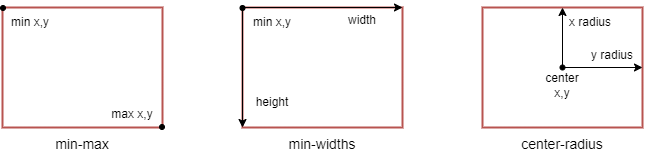

# Collision
Il existe plusieurs objectifs à la mise en place de tests de collision et donc plusieurs stratégies.

Dans le cas des shoot 'em up, toute collision est "fatale", le test doit simplement permettre de savoir s'il y a eu collision, pas de savoir a quelle position.
Les jeux de plateformes permettre au contraire des interactions avec le sol ou des objets solides.

## shoot 'em up

Dans un shoot 'em up il est important de permettre au joueur d'avoir un retour visuel sur une collision qui s'est produite.
Ainsi il est préférable de voir les objets entrer en collision avant de les faire exposer.
Etant donné qu'il n'y a pas d'interaction entre les positions des objets (pas de résistance au sol ou aux murs, on ne pousse pas les objets non plus), il est possible de réaliser les tests de collision en dehors des routines objets.

Position des tests de collision dans la boucle principale du programme :

```
MainLoop
        jsr   WaitVBL
        jsr   ReadJoypads
        jsr   DoCollision ; le test est réalisé après le rendu et avant la prochaine exécution des routines objets
        jsr   RunObjects
; ...
        jsr   DrawSprites
        bra   MainLoop
```

Les routines d'affichage font une conversion des positions dans le référentiel du terrain de jeu (16bits) en positions écran (8bits).
Nous allons donc pouvoir utiliser ces calculs déjà réalisés pour effectuer les tests de collision sur 8bits.

## Axis-Aligned Bounding Box

Une zone de collision peut être définie de plusieurs manière.
Dans ce chapitre nous allons utilisé les AABB (Axis-Aligned Bounding Box), il s'agit d'un rectangle dont les cotés sont alignés sur les axes x et y.


Une AABB est généralement représentée de trois manières différentes :



**min-max**
- x_min, x_max, y_min, y_max

**min-widths**
- x, y, width, height

**center-radius**
- center x, center y, radius x, radius y

Les routines de collision de ce chapitre utilisent la représentation center-radius.

## Déclaration des zones de collision

Chaque objet est responsable de déclarer ou modifier lui même ses zones de collision lorsque cela est nécessaire.
L'objet est également en charge du déréférencement des zones lorsque celles-ci ne sont plus utiles.

Pour déclarer une zone de collision l'objet va appeller la routine suivante :
```
        jsr AddAABB
```

En retour cette routine va donner dans le registre X, l'adresse d'un slot disponible pour les données de la zone de collision.
L'objet va donc utiliser le pointeur X pour paramétrer les valeurs de la zone suivant cette organisation des données (toutes sur 8 bits):

- potentiel
- rayon x
- rayon y
- centre x
- centre y

Exemple :
```
        lda   #10
        sta   AABB.potentiel,x
        _ldd  10,5
        std   AABB.radius,x
        _ldd  xy_pixels,u
        std   AABB.center,x
```

Dans cet exemple nous positionnons un potentiel de 10 points à la zone de collision, puis définissons un rectangle de 20 pixels de largeur par 10 pixels de hauteur en paramétrant un radius de 20/2 = 10 et un radius y de 10/2 = 5.
Le positionnement de la zone est centrée sur celle de l'objet, par conséquent nous recopions la valeur de positionnement écran de l'objet (xy_pixel) pour définir la position de la zone.
si la zone doit être positionnée de manière décalée par rapport à l'objet, une simple addition peut être ajoutée :
```
        _ldd  xy_pixels,u
        adda  #5            ; décale le centre de la zone de collision de 5px vers
        std   AABB.center,x ; la droite par rapport au centre de l'objet
```

Enfin, l'objet sauvegardera le pointeur de la zone. Seul l'objet conserve la liste de ses zones associées, cette information n'est pas stockée par le moteur de jeu.

```
        AABB1 equ ext_variables
; ...
        stx   AABB1,u
```

La routine AddAABB contient le code suivant :

```

```

## Suppression des zones de collision

Pour supprimer une zone de collision l'objet va appeller la routine suivante :
```
        jsr DeleteAABB
```

Cette routine contient le code suivant :

```

```

## Test de collision

```
r = a.rx + b.rx;
if ((unsigned int)(a.cx - b.cx + r) > r + r) return 0;
r = a.ry + b.ry;
if ((unsigned int)(a.cy - b.cy + r) > r + r) return 0;
return 1;
 
u->p,cx,cy,rx,ry
x->p,cx,cy,rx,ry
with :
   cx,cy : box center (offset to x_pos)
   rx,ry : box radius
   p : remaining potential
 
si en px
 
        ldu   #AABB_a
        ldx   #AABB_b
        lda   rx,u
        adda  rx,x
        sta   @rx
        adda  cx,u
        suba  cx,x
        asra
        cmpa  #0
@rx     equ *-1 
        ble   >
        rts
!       lda   ry,u
        adda  ry,x
        sta   @ry
        adda  cy,u
        suba  cy,x
        asra
        cmpa  #0
@ry     equ *-1 
        ble   >
        rts
!       ldb   #0
        lda   p,u
        suba  p,x
        beq   @draw
        bmi   @lose
@win    sta   p,u
        stb   p,x
        rts
@loose  lda   p,x
        suba  p,u
        sta   p,x
        stb   p,u
        rts
@draw   stb   p,u
        stb   p,x
        rts
```