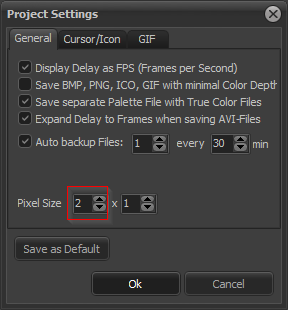

# Pro Motion NG - F.A.Q.

- [Changer la profondeur d'image 4bpp en 8bpp](#color-depth)
- [Afficher son projet au ratio 2:1](#ratio)
- [Manipuler la palette](#palette)
- [Convertir une image en tilemap](#tilemap)

## Changer la profondeur d'image 4bpp en 8bpp

Par défaut Pro Motion NG est configuré pour enregistrer les images avec le minimum de profondeur de couleurs. Une image avec 16 couleurs ou moins sera donc enregistrée en 4 bits par pixel.

Pour forcer l'enregistrement en 8 bits par pixels, il y a deux réglages possibles :

- au niveau des paramètres de l'application

Il faut décocher l'option "Save BMP, PNG, ICO, GIF with minimal Color Depth"

- au niveau du projet

Il faut décocher l'option "Save BMP, PNG, ICO, GIF with minimal Color Depth"

## Afficher son projet au ratio 2:1

Pour afficher une image au ratio 2:1, aller dans les préférences et sélectionner "Pixel Size" à 2x1 :

Attention, à la sauvegarde l'option "Apply Pixel Size" est cochée par défaut. Cela signifie que l'image sera sauvegardée en effectuant un redimensionnement x2 en largeur.
Pensez à la décocher pour conserver une image à la dimension d'origine.

## Manipuler la palette

à renseigner

## Convertir une image en tilemap

à renseigner
