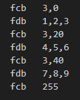

# Procédure pour générer les assets du scroll vertical BM16
## tilemap et tileset

1 - depuis pro motion, faire "export all" et choisir export du tileset en un seul fichier avec une seule colonne

	- format de la map : .stm
	- prefixe des fichiers: level1
	- répertoire de destination : thomson-to8-game-engine\game-projects\goldorak\objects\scroll\level1 

2 - ensuite avec les outils 6809-game-builder :

- génération de la map:
    
    La commande suivante effectue la conversion d'un fichier stm avec tile id 32bit en map binaire avec des tile id de 12bit. La valeur des id de tile est doublée (valeurs paires uniquement). Le header stm n'est pas conservé dans le fichier bin de sortie.

		stm2bin -f="C:\Users\bhrou\git\thomson-to8-game-engine\game-projects\goldorak\objects\scroll\level1\level1.stm" -obd=12 -mul=2 

    Signification des paramètres :

    * odb : output bit depth for a tile id = 12bit
    * mul : output tile id multiplicator = 2

- génération des buffers de départ
    
    La commande suivante va générer deux buffers contenant du code et des données. Il s'agit d'encoder l'image qui sert de point de départ au scroll. L'image png en entrée de la conversion doit etre de taille 160x200 pour un scroll plein écran (peut être plus petit en fonction du viewport désiré).

		png2bin -f C:\Users\bhrou\git\thomson-to8-game-engine\game-projects\goldorak\objects\scroll\level1\level1.start.png -lb 4 -pb 8 -p 2 -pd 4 -vs -slc

    Signification des paramètres :

    * lb  : linear bits, number of bits that defines a pixel in a plane = 4bit
    * pb  : planar bits, number of bits to process before going next plane = 8bits
    * p   : planes, number of memory planes = 2
    * pd  : pixel depth, number of bits per pixel = 4
    * vs  : output data buffer for Vertical Scroll
    * slc : shift colors indexes to the left by one position

    Le code suivant sera déclaré dans les deux objets portant les buffer de code. La ligne supplémentaire est incluse par macro en fin de buffer :

            INCLUDE "./engine/graphics/tilemap/vscroll/vscroll.macro.asm"
        @loop
            INCLUDEBIN "./objects/scroll/level1/level1.start.0.0.bin.vscroll"
            _vscroll.buffer.line
            jmp   @loop

- génération du tileset

    Dans la version actuelle du scroll vertical, le tileset est de taille fixe (512 tiles). Il faut donc compléter l'image en hauteur pour qu'elle soit de taille 8192 pixels avant de lancer la commande suivante :
		
		png2bin -f C:\Users\bhrou\git\thomson-to8-game-engine\game-projects\goldorak\objects\scroll\pro-motion\level1.tiles.png -lb 4 -pb 8 -p 2 -pd 4 -vst -slc 

    Signification des paramètres :

    * vst : output tile data for Vertical Scroll"

## tile sprites

Il est possible de mettre à jour dynamiquement les tiles de la tilemap au runtime.
La mise à jour est effectuée à la fois dans la tilemap, mais également au niveau des buffers de code qui effectuent l'affichage des pixels.

Pour permettre à l'algorithme de fonctionner, il faut d'une part ajouter les tiles correspondant aux images, mais aussi le mapping de ces tiles (l'id et la position de chaque tile constituant une image).

1 - Les images doivent être réunies dans un seul fichier pour facilier la constitution des données, une représentation verticale est nécessaire pour les étapes suivantes.

Exemple ici avec les tiles de battlesquadron, on souhaite mettre à jour les images lorsque les ennemis au sol sont détruits :

2 - A l'aide de pro motion NG ou de tout autre outil, convertir l'image en tilemap :

Utiliser obligatoirement une taille de tile de 8x16 et décocher l'usage des tiles mirroir.

3 - Réaliser un export des données (tilemap au format texte, ainsi que le tileset avec un tile par ligne) :

4 - Ouvrir le fichier .txm contenant la tilemap au format texte :
Chaque ligne correspond à une rangée de tiles dans la tilemap.

Exemple de correspondance avec les images pour les trois premières lignes :

5 - Il faut maintenant transformer manuellement ces données pour produire le code assembleur correspondant, en ajoutant des informations de placement.

La structure de données a respecter est la suivante :

Ainsi le tableau de données pour cette première image est le suivant :

Avant chaque ligne contenant les tile_id, on insère deux octets, le premier indique le nombre de tiles consécutifs (en partant de la gauche), ainsi qu'un offset (déplacement) pour la séquence de tile suivante.

L'offset part de la position du premier tile dans la séquence, ceci afin d'éviter les calculs pour les sauts de ligne.
Dans le cas d'un scroll full screen la largeur d'écran est de 20 tiles.

Un nombre de tiles consécutifs à 255 marque la fin du tableau.

6 - Pour faciliter la saisie et la mise à jour des index de tile pour ces images, on utilise un equate pour donner le point de départ des tiles spécifiques à la mise à jour de la tilemap au runtime.

Dans l'exemple ci dessous il y avait 512 tiles pour le décors de départ de la tilemap, on vient donc ajouter cet offset aux id de tiles.

Au final on assigne un label à chaque image ce qui donne le code source suivant :

7 - Il reste a ajouter l'image suivante contenant les tiles additionnels à l'image contenant les tiles déjà présents pour le scroll :

Important : l'image en hauteur doit être eaxctement de la taille : 256*16, 512*16, 1024*16 ou 2048*16 pixels.

On vient ajouter les tiles à la suite en veillant à conserver le tile vide (ou alors il faut décaler tous les index dans l'asm) :

8 - Une fois l'image sauvegardée, il faut jouer la conversion de l'image en binaire (bitmap) :

		png2bin -f C:\Users\bhrou\Pictures\tilemaps\level1-1024.png -lb 4 -pb 8 -p 2 -pd 4 -vst -slc

9 - les fichiers de sortie utiles sont les suivants :

- level1-1024.0.0.bin.1024.0.vscrolltile
- level1-1024.0.0.bin.1024.1.vscrolltile
- level1-1024.1.0.bin.1024.0.vscrolltile
- level1-1024.1.0.bin.1024.1.vscrolltile

Chaque fichier doit être placés dans le projet de jeu sous la forme d'un objet. On va donc créer un fichier .properties et un fichier .asm pour chaque fichier .vscrolltile (ici en exemple pour A1, on fera A1, A2, B1, B2):

level1TileA1.properties
code=./objects/scroll/level1/level1TileA1.asm

level1TileA1.asm
        INCLUDEBIN "./objects/scroll/level1/level1-1024.0.0.bin.1024.0.vscrolltile"

10 - Dans la définition du gamemode (.properties), on ajoute la déclaration des objets :

object.level1TileA1=./objects/scroll/level1/level1TileA1.properties
object.level1TileA2=./objects/scroll/level1/level1TileA2.properties
object.level1TileB1=./objects/scroll/level1/level1TileB1.properties
object.level1TileB2=./objects/scroll/level1/level1TileB2.properties

et dans le main.asm on utilise les lignes suivantes pour initialiser les objets :

        _vscroll.setTileset1024 ObjID_level1TileA1,ObjID_level1TileA2,ObjID_level1TileB1,ObjID_level1TileB2
        _vscroll.setTileNb #1024

A titre d'exmple, l'utilisation du scroll s'effectue ainsi pour un tileset maximum de 1024 tiles (on peut avoir 256, 512, 1024 ou 2048 tiles):

**Initialisation**

    INCLUDE "./engine/graphics/tilemap/vscroll/vscroll.macro.asm"
    ...
            _vscroll.setMap #ObjID_level1Map
            _vscroll.setMapHeight #512*16
            _vscroll.setTileset1024 ObjID_level1TileA1,ObjID_level1TileA2,ObjID_level1TileB1,ObjID_level1TileB2
            _vscroll.setTileNb #1024
            _vscroll.setBuffer #ObjID_scrollA,#ObjID_scrollB
            _vscroll.setCameraPos #512*16-200
            _vscroll.setCameraSpeed #$ff80
            _vscroll.setViewport #0,#200

**Affichage dans la boucle principale**

            _gfxlock.on
             jsr   vscroll.do
             jsr   vscroll.move
             _gfxlock.off
    ....
    INCLUDE "./engine/graphics/tilemap/vscroll/vscroll.asm"